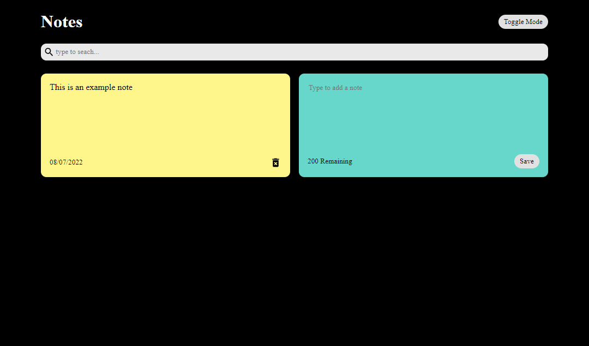

# React Notes App

A Google Keep style notes app coded using React with local storage used to hold data. I have built similar projects to this in the past as part of courses but created this one as a code ahead of [Chris Blakely's](https://www.youtube.com/watch?v=8KB3DHI-QbM) YouTube video to see if I could create something similar. I also found it useful to observe his workflow.

    
    

## What I Did
The app checks local storage on first load and populates the notes state variable with an array of stored notes, if any, or leaves an empty array if note. The app has three first level components, the Header which contains the title and toggle switch for dark mode, a Search component to search within notes and then a NotesList which maps the stored information on to a second level Note component and also contains a level two component for adding a new note.

Most functionality is contained within the App compoenent with the props drilled down to where they are needed. I am not yet experienced with the Context API so have not investigated this alternative approach.

Functionality is provided through useState, including callbacks to previous state, useEffect, conditional rendering and js map and filter methods.

## What I learned
* The white-space css style.
* Having js.filter work on a state variable to provide change-on-type functionality.
* React Icons.
